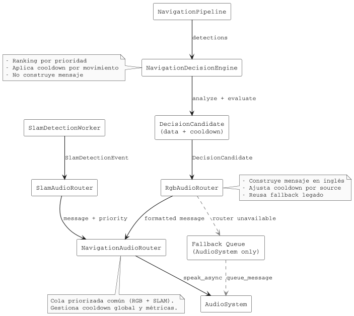

# Flujo de Audio de Navegación

Este documento resume cómo los eventos RGB y SLAM convergen en el `NavigationAudioRouter` tras la refactorización que separa decisión y formateo.

## Visión general

1. `NavigationPipeline` procesa cada frame RGB y entrega detecciones al `NavigationDecisionEngine`.
2. El engine genera un `DecisionCandidate`: incluye el objeto priorizado, metadatos (zona, distancia, cooldown sugerido) y la prioridad, pero **no** crea el mensaje hablado.
3. `RgbAudioRouter` recibe el candidato, arma la frase en inglés, ajusta el cooldown de la fuente y encola el resultado en el `NavigationAudioRouter`. Si la cola no está disponible, recurre directamente al `AudioSystem`.
4. De forma paralela, cada `SlamDetectionWorker` produce `SlamDetectionEvent` que `SlamAudioRouter` filtra, prioriza y transforma en mensajes antes de encolarlos en el router común.
5. `NavigationAudioRouter` es la cola priorizada compartida. Aplica cooldown global, mide métricas, escribe telemetría y envía los mensajes al `AudioSystem`.

## Diagrama de flujo

> Exporta el `.puml` desde `docs/architecture/navigation_audio_flow.puml` si necesitas la imagen en otros formatos.

## Impacto del cambio

- Las decisiones RGB ahora se representan como datos puros (`DecisionCandidate`), alineando la arquitectura con SLAM y facilitando nuevas salidas (p. ej. HUD o telemetría).
- `RgbAudioRouter` encapsula la lógica de formateo y mantiene el fallback legado, lo que simplifica al coordinator y aísla la presentación de la lógica de negocio.
- El `NavigationAudioRouter` sigue siendo el punto de unión; no se modifica su contrato, sólo recibe mensajes más consistentes desde ambas fuentes.
