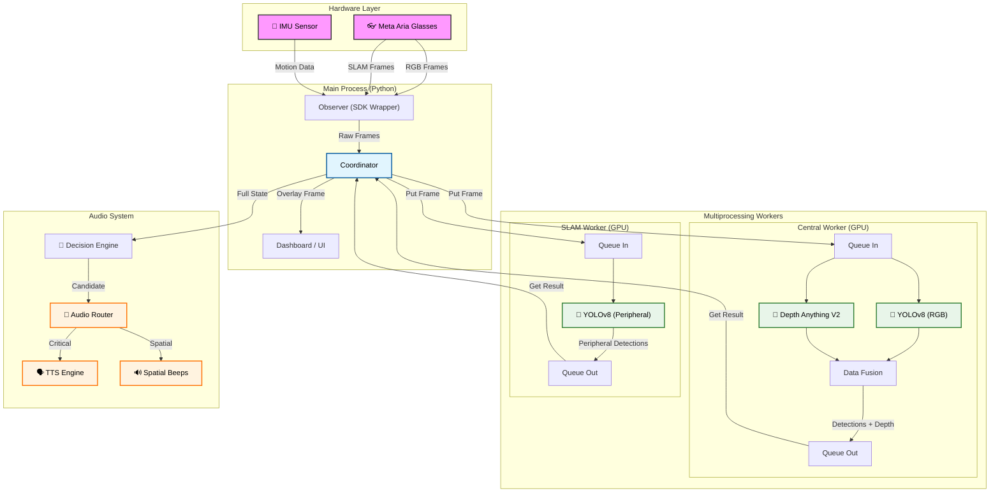

# 🏗️ Arquitectura del Sistema (High-Level)

Este diagrama representa el flujo de datos y la separación de procesos del **Aria Navigation System**.

## 📝 Explicación del Flujo

1.  **Captura (Main Process):** El `Observer` extrae los frames de las gafas Aria usando el SDK oficial.
2.  **Distribución (Coordinator):** El `Coordinator` envía los frames a las colas de procesamiento (`Queue In`), separando la cámara central (RGB) de las periféricas (SLAM).
3.  **Procesamiento Paralelo (Workers):**
    *   **Central Worker:** Ejecuta YOLO (detección) y Depth-Anything (profundidad) en paralelo usando **CUDA Streams** en la GPU.
    *   **SLAM Worker:** Ejecuta un modelo YOLO más ligero para detectar amenazas laterales.
4.  **Fusión y Decisión:** Los resultados vuelven al `Coordinator`, que se los pasa al `Decision Engine`. Este aplica lógica de prioridades (¿Es una persona? ¿Está cerca?).
5.  **Feedback (Audio):** El `Audio Router` gestiona la salida para no saturar al usuario, mezclando pitidos espaciales (`Beeps`) con instrucciones verbales (`TTS`).
