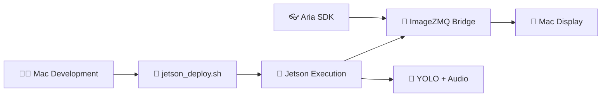

# 🚀 Development Workflow Guide - Mac-Jetson Architecture

## 📋 **RESUMEN ARQUITECTURA**



**PRINCIPIOS CLAVE:**
- ✅ **Un solo lugar para desarrollo**: Mac
- ✅ **Sincronización automática**: Script deploy
- ✅ **Jetson como worker**: Solo ejecuta código Mac
- ✅ **Zero duplication**: Fuente única de verdad

---

## 🛠️ **SETUP INICIAL COMPLETO**

### **1. Preparación Mac (Master)**
```bash
cd ~/aria-navigation-tfm

# Hacer executable el deploy script
chmod +x jetson_deploy.sh
chmod +x quick_deploy.sh

# Verificar estructura
ls -la src/
# Debe mostrar: core/ utils/ presentation/
```

### **2. Primera Sincronización**
```bash
# Configurar IP del Jetson (actualizar en script si es necesario)
export JETSON_IP=192.168.8.204
export JETSON_USER=aria

# Ejecutar deploy completo
./jetson_deploy.sh
```

### **3. Verificación en Jetson**
```bash
# Conectar al Jetson
ssh aria@192.168.8.204

# Verificar sincronización
cd ~/jetson-aria
ls -la src/
python3 jetson_server.py test-components
```

---

## 🔄 **WORKFLOW DE DESARROLLO DIARIO**

### **Desarrollo Típico (Mac)**
```bash
# 1. Editar código en Mac (como siempre)
code src/core/vision/yolo_processor.py
code src/core/audio/audio_system.py

# 2. Test local en Mac (opcional)
python3 main.py

# 3. Sincronizar cambios al Jetson
./quick_deploy.sh  # Más rápido para cambios pequeños
# O para sync completo:
./jetson_deploy.sh

# 4. Test en Jetson
ssh aria@192.168.8.204 "cd ~/jetson-aria && python3 jetson_server.py test"
```

### **Ejecución del Pipeline Completo**
```bash
# Terminal 1: Jetson Worker
ssh aria@192.168.8.204
cd ~/jetson-aria
python3 jetson_server.py

# Terminal 2: Mac Bridge
cd ~/aria-navigation-tfm
python3 mac_sender.py
```

---

## 🎯 **CASOS DE USO ESPECÍFICOS**

### **Caso 1: Modificar YOLO Processor**
```bash
# 1. Mac: Editar YoloProcessor
vim src/core/vision/yolo_processor.py

# 2. Sync rápido
./quick_deploy.sh

# 3. Reiniciar Jetson (solo el processing)
ssh aria@192.168.8.204 "pkill -f jetson_server.py"
ssh aria@192.168.8.204 "cd ~/jetson-aria && python3 jetson_server.py &"

# 4. No reiniciar Mac sender (sigue funcionando)
```

### **Caso 2: Cambios en Audio System**
```bash
# 1. Mac: Modificar AudioSystem  
vim src/core/audio/audio_system.py

# 2. Deploy cambios
./jetson_deploy.sh

# 3. Test específico de audio
ssh aria@192.168.8.204 "cd ~/jetson-aria && python3 jetson_server.py test-components"
```

### **Caso 3: Nuevo Componente**
```bash
# 1. Mac: Crear nuevo módulo
touch src/core/navigation/new_feature.py

# 2. Implementar funcionalidad
code src/core/navigation/new_feature.py

# 3. Deploy completo (incluye nuevos archivos)
./jetson_deploy.sh

# 4. Verificar en Jetson
ssh aria@192.168.8.204 "cd ~/jetson-aria && ls -la src/core/navigation/"
```

---

## 🔧 **COMANDOS ÚTILES**

### **Development Commands**
```bash
# Deploy rápido (solo archivos cambiados)
./quick_deploy.sh

# Deploy completo (incluye nuevos archivos) 
./jetson_deploy.sh

# Test componentes sin ejecutar pipeline
ssh aria@192.168.8.204 "cd ~/jetson-aria && python3 jetson_server.py test"

# Monitor GPU Jetson en tiempo real
ssh aria@192.168.8.204 "cd ~/jetson-aria && ./monitor_gpu.sh"

# Test conexión Mac-Jetson
python3 mac_sender.py test-jetson
```

### **Debugging Commands**
```bash
# Logs en tiempo real del Jetson
ssh aria@192.168.8.204 "cd ~/jetson-aria && tail -f logs/jetson_worker.log"

# Stats de ImageZMQ
python3 mac_sender.py test

# Verificar sincronización
diff -r src/ aria@192.168.8.204:~/jetson-aria/src/
```

---

## 📊 **PIPELINE DE TESTING**

### **Test Levels**
```bash
# Level 1: Component Tests (Mac)
python3 src/core/navigation/builder.py  # Test builder
python3 src/core/vision/yolo_processor.py  # Test YOLO

# Level 2: Integration Tests (Jetson)
ssh aria@192.168.8.204 "cd ~/jetson-aria && python3 jetson_server.py test-components"

# Level 3: End-to-End Tests
python3 mac_sender.py test-jetson  # Test communication
# Then run full pipeline

# Level 4: Performance Tests  
ssh aria@192.168.8.204 "cd ~/jetson-aria && ./monitor_gpu.sh" &
python3 mac_sender.py  # Run with monitoring
```

---

## 🚨 **TROUBLESHOOTING GUIDE**

### **"Import Errors en Jetson"**
```bash
# Causa: Código no sincronizado
# Solución:
./jetson_deploy.sh
ssh aria@192.168.8.204 "cd ~/jetson-aria && python3 jetson_server.py test-components"
```

### **"ImageZMQ Connection Failed"**
```bash
# Verificar network
ping 192.168.8.204

# Verificar puertos
ssh aria@192.168.8.204 "netstat -tlnp | grep 5555"

# Verificar Jetson server ejecutándose
ssh aria@192.168.8.204 "ps aux | grep jetson_server"
```

### **"No Frames from Aria"**
```bash
# Verificar Aria SDK
python3 -c "import aria.sdk as aria; print('Aria SDK OK')"

# Test Aria connection
python3 main.py  # Test standalone en Mac
```

### **"GPU Not Available en Jetson"**
```bash
# Verificar CUDA
ssh aria@192.168.8.204 "nvidia-smi"

# Verificar PyTorch CUDA
ssh aria@192.168.8.204 "python3 -c 'import torch; print(torch.cuda.is_available())'"
```

---

## 📈 **PERFORMANCE OPTIMIZATION**

### **Development Speed**
- Usar `quick_deploy.sh` para cambios menores
- Mantener `jetson_server.py` ejecutándose entre deployments
- Usar tests específicos (`test-components`) antes del pipeline completo

### **Runtime Performance**  
- Monitor GPU usage: `./monitor_gpu.sh`
- Ajustar FPS limits en configs
- Optimizar buffer sizes según latencia requerida

### **Network Optimization**
- Red local para mínima latencia ImageZMQ
- Comprimir frames si bandwidth es limitado
- Usar ethernet en lugar de WiFi si es posible

---

## 🎯 **BEST PRACTICES**

### **Development**
1. **Single Source of Truth**: Todo el código se desarrolla en Mac
2. **Frequent Sync**: Deploy después de cada funcionalidad
3. **Component Testing**: Test individual antes de integration
4. **Version Control**: Git solo en Mac, Jetson es deployment target

### **Deployment** 
1. **Automated Sync**: Usar scripts, no manual copy
2. **Verification**: Siempre test después de deploy
3. **Rollback**: Mantener versión estable conocida
4. **Documentation**: Documentar cambios de configuración

### **Production**
1. **Error Handling**: Robust error recovery en ambos lados
2. **Monitoring**: Logs y stats en tiempo real
3. **Performance**: Monitor GPU/CPU/Network continuously
4. **Maintenance**: Regular cleanup de logs y archivos temporales

---

## 📝 **PRÓXIMOS PASOS**

### **Immediate (Next Session)**
- [ ] Test completo del pipeline Mac-Jetson
- [ ] Verificar latencia end-to-end
- [ ] Optimizar buffer sizes y FPS
- [ ] Validar reconexión automática

### **Short Term (This Week)**  
- [ ] Add compression para reducir bandwidth
- [ ] Implementar health checks automáticos
- [ ] Dashboard con métricas en tiempo real
- [ ] Error recovery mechanisms

### **Medium Term (Next Weeks)**
- [ ] Add peripheral vision processing
- [ ] Stereo depth integration
- [ ] Advanced audio spatial features
- [ ] Performance profiling y optimization

---

## 📚 **REFERENCE**

### **File Structure**
```
📱 MAC (~/aria-navigation-tfm)
├── src/core/              ← Main development here
├── src/utils/config.py    ← Shared configuration  
├── jetson_deploy.sh       ← Full deployment
├── quick_deploy.sh        ← Fast deployment
├── mac_sender.py          ← Bridge to Jetson
└── main.py                ← Standalone Mac mode

🤖 JETSON (~/jetson-aria)
├── src/                   ← Copied from Mac
├── jetson_server.py       ← Generated by deploy
├── logs/                  ← Runtime logs
└── requirements.txt       ← Dependencies
```

### **Key Commands**
- `./jetson_deploy.sh` - Full sync Mac → Jetson
- `./quick_deploy.sh` - Fast sync changed files only  
- `python3 jetson_server.py` - Start Jetson worker
- `python3 mac_sender.py` - Start Mac bridge
- `ssh aria@192.168.8.204` - Connect to Jetson

---

**🎉 ARQUITECTURA MAC-JETSON LISTA PARA DESARROLLO ITERATIVO EFICIENTE**