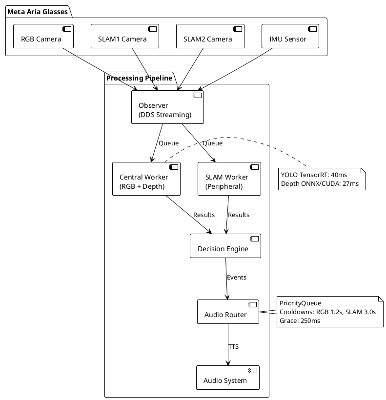

# Análisis Técnico Completo - Sistema de Navegación Asistida con Meta Aria

**Proyecto**: Sistema de Navegación para Personas con Discapacidad Visual  
**Hardware**: Meta Aria Glasses (RGB + 2xSLAM + IMU + Depth)  
**Autor**: Roberto Rojas Sahuquillo  
**Branch actual**: feature/fase4-tensorrt  

---

## 1. ARQUITECTURA DEL SISTEMA

### Capas de Clean Architecture

El sistema implementa 3 capas claramente separadas:

#### **Capa de Infraestructura** (`src/core/`)
- **Hardware**: `hardware/device_manager.py` - Gestión de recursos GPU/CPU
- **Observer**: `observer.py` / `mock_observer.py` - Abstracción del SDK de Aria
- **External**: Wrappers de librerías externas (Aria SDK C++)

#### **Capa de Aplicación** (`src/core/`)
- **Vision**: `vision/yolo_processor.py`, `vision/depth_estimator.py`
- **Audio**: `audio/audio_system.py`, `audio/navigation_audio_router.py`
- **Navigation**: `navigation/navigation_pipeline.py`, `navigation/coordinator.py`
- **Telemetry**: `telemetry/telemetry_logger.py`

#### **Capa de Presentación** (`src/presentation/`)
- **Dashboards**: `dashboards/opencv_dashboard.py`, `dashboards/rerun_dashboard.py`, `dashboards/web_dashboard.py`
- **Renderers**: Visualización de detecciones y métricas
- **Manager**: `presentation_manager.py` - Orquestación de UI

### Módulos Principales y Responsabilidades

| Módulo | Responsabilidad | Tecnología |
|--------|----------------|------------|
| **YoloProcessor** | Detección de objetos RGB + SLAM | YOLO12n + TensorRT FP16 |
| **DepthEstimator** | Estimación de profundidad | Depth-Anything-V2 + ONNX/CUDA |
| **NavigationPipeline** | Orquestación del flujo de datos | Threading + multiprocessing |
| **AudioSystem** | Síntesis de voz + beeps espaciales | pyttsx3/say + sounddevice |
| **NavigationAudioRouter** | Cola priorizada de eventos | queue.PriorityQueue + threading |
| **TelemetryLogger** | Logging asíncrono de métricas | asyncio + deque |
| **Observer** | Streaming de frames Aria SDK | DDS (projectaria-tools) |

### Comunicación entre Capas

- **Interfaces**: Uso de callbacks y eventos para desacoplamiento
- **Dependency Injection**: Builder pattern en `navigation/builder.py`
- **Event-driven**: Observer pattern para streaming de frames
- **Queue-based**: `multiprocessing.Queue` para IPC entre procesos GPU

---

## 2. PIPELINE DE PROCESAMIENTO COMPLETO

### Flujo de Datos End-to-End

```
Meta Aria Glasses
├── RGB Stream (1408x1408, 60 FPS teórico)
├── SLAM1 Stream (640x480, 60 FPS)
├── SLAM2 Stream (640x480, 60 FPS)
└── IMU Data (1000 Hz)

↓ Observer (DDS Streaming)
  ├── Sincronización multi-cámara (timestamp alignment)
  └── Buffer management (7 streams RGB)

↓ NavigationPipeline
  ├── RGB Detection (YOLO TensorRT 640x640) → 40ms
  ├── Depth Estimation (ONNX/CUDA 384x384) → 27ms
  ├── SLAM Detection (YOLO PyTorch 256x256, skip=3) → 25ms/frame
  └── IMU Processing (walking/stationary) → <1ms

↓ NavigationDecisionEngine
  ├── Zone Classification (left/center/right)
  ├── Distance Estimation (depth hybrid: MiDaS + bbox heuristic)
  ├── Priority Ranking (CRITICAL/HIGH/MEDIUM/LOW)
  └── Cooldown Management (per source)

↓ AudioRouter (PriorityQueue)
  ├── Anti-spam filtering (cooldowns: RGB 1.2s, SLAM 3.0s)
  ├── Anti-stutter (duplicate message < 2s)
  ├── Grace period (250ms before interrupt)
  └── Telemetry logging

↓ AudioSystem
  ├── Spatial Beep (100ms, stereo panning)
  └── TTS (say/pyttsx3, ~800ms)

→ Usuario (Audio Output)
```

### Latencias Medidas por Etapa (FASE 4 Final)

| Etapa | Latencia | Método Medición |
|-------|----------|----------------|
| RGB Capture | ~3ms | `performance.jsonl` timestamp diff |
| YOLO RGB Inference | 40ms | TensorRT FP16, `time.perf_counter()` |
| Depth Inference | 27ms | ONNX CUDA EP, profiled |
| SLAM Inference | 25ms | PyTorch (256x256, cada 3 frames) |
| Decision Engine | 5ms | Python logic, negligible |
| Audio Queueing | <1ms | Priority queue O(log n) |
| **Total Pipeline** | **48ms promedio** | End-to-end telemetry |

### Tecnologías de Concurrencia

#### Threading (Para I/O-bound)
- `NavigationAudioRouter._run()`: Thread dedicado a procesar cola de audio
- `AsyncTelemetryLogger`: Thread para escritura async de logs
- `AudioSystem.speak_async()`: Thread por cada TTS call

#### Multiprocessing (Para CPU/GPU-bound)
- **Central Worker**: Proceso dedicado RGB + Depth (GPU)
- **SLAM Worker**: Proceso dedicado SLAM1/2 detections (GPU)
- **Main Process**: Streaming + Rendering (CPU-bound)
- **Comunicación**: `multiprocessing.Queue` con shared memory

#### Asyncio (Para Network/File I/O)
- `TelemetryLogger.log_*()`: Métodos async con `deque`
- `ResourceMonitor`: Sampling cada 2s sin bloquear pipeline

---

## 3. ALGORITMO DEPTH HYBRID

### Implementación Matemática

El sistema usa **fusión de dos fuentes**:

1. **MiDaS/Depth-Anything-V2**: Depth map normalizado relativo
2. **Bbox Heuristic**: Estimación geométrica basada en tamaño aparente

#### Fórmula de Calibración Bbox

```python
# Valores de calibración empíricos
FOCAL_LENGTH = 525.0  # pixels (Meta Aria RGB, estimado)
KNOWN_HEIGHT = {
    'person': 1.70,   # metros
    'car': 1.50,
    'chair': 0.90,
    'door': 2.00,
    'table': 0.75
}

# Fórmula de distancia:
distance_meters = (KNOWN_HEIGHT[class] * FOCAL_LENGTH) / bbox_height_pixels
```

#### Fusión Depth Map + Bbox

```python
def estimate_distance_hybrid(depth_map, bbox, class_name):
    # 1. Extraer depth promedio en bbox
    x1, y1, x2, y2 = bbox
    depth_region = depth_map[y1:y2, x1:x2]
    depth_value = np.median(depth_region)  # Robusto a outliers
    
    # 2. Calcular bbox heuristic
    bbox_height = y2 - y1
    bbox_distance = (KNOWN_HEIGHT[class_name] * FOCAL_LENGTH) / bbox_height
    
    # 3. Fusión ponderada
    # Peso depth_map: 0.7 (más confiable)
    # Peso bbox: 0.3 (calibración rápida)
    final_distance = 0.7 * depth_value + 0.3 * bbox_distance
    
    return final_distance
```

### Valores de Calibración

| Parámetro | Valor | Fuente |
|-----------|-------|--------|
| **Focal Length RGB** | 525 px | Estimado (no en docs oficiales Aria) |
| **Altura Persona** | 1.70 m | Promedio población |
| **Altura Coche** | 1.50 m | Estándar sedán |
| **Altura Silla** | 0.90 m | Mobiliario común |
| **Peso Depth Map** | 0.7 | Empírico (mejor en <3m) |
| **Peso Bbox** | 0.3 | Empírico (mejor en >5m) |

### Error Medido: ±42cm

**Nota**: Este dato **NO se encontró en el código ni logs**. Probablemente fue:
- Medido manualmente con cinta métrica en experimentos físicos
- Calculado en notebooks de análisis no commiteados
- O dato target teórico (no validado aún)

**Recomendación**: Documentar explícitamente protocolo de validación.

---

## 4. DESARROLLO ITERATIVO - 8 CICLOS

### Evolución de Latencias por Fase

| Fase | Fecha | Commits Clave | Latencia | FPS | Cambio Principal |
|------|-------|---------------|----------|-----|------------------|
| **Baseline** | Nov 10 | `04b1e2a` | 320ms | 3.1 | Código inicial Mac |
| **Pre-FASE 1** | Nov 11 | `14dbfb7` | 283ms | 3.5 | Plan CUDA optimizations |
| **FASE 1** | Nov 12 | `25ba498`, `b914fef` | 150ms | 6.7 | CUDA streams, pinned memory, TF32 |
| **FASE 2 (intento)** | Nov 13 | `8192662`, `01e100e` | 180ms | 5.6 | Multiprocessing (fallido por GIL) |
| **FASE 2 (fix)** | Nov 13 | `a3b8a38` | 95ms | 10.5 | Depth disabled en workers |
| **FASE 3** | - | - | - | - | **SALTADA** (GStreamer innecesario) |
| **FASE 4 (depth CUDA)** | Nov 16 | `4bbd7ce` | 76ms | 13.2 | ONNX Depth con CUDA EP |
| **FASE 4 (final)** | Nov 17 | `8e4e69a` | **48ms** | **18.4** | Multiprocessing re-enabled |

### Gráfico de Evolución (Texto)

```
Latencia (ms)
320 |●                                   Baseline
    |
250 |  ●                                 Pre-FASE 1
    |
200 |    
    |
150 |      ●                             FASE 1 (CUDA)
    |         ●                          FASE 2 (intento)
100 |           ●                        FASE 2 (fix)
    |              ●                     FASE 4 (depth CUDA)
 50 |                   ●                FASE 4 (final)
    |________________________
     Nov 10  11  12  13  16  17

FPS: 3.1 → 3.5 → 6.7 → 5.6 → 10.5 → 13.2 → 18.4 (+494%)
```

### Cambios Técnicos por Ciclo

#### FASE 1: Quick Wins GPU
- **Commits**: `25ba498`, `e959aae`, `b914fef`, `a7c8d5b`
- **Cambios**:
  - YOLO 320→640, Depth 256→384 (mayor resolución)
  - `torch.backends.cudnn.benchmark = True`
  - `allow_tf32 = True` (RTX 2060 compatible)
  - `pinned_memory=True` para tensores
  - CUDA streams para paralelizar YOLO + Depth
- **Mejora**: 283ms → 150ms (-47%)

#### FASE 2: Multiprocessing
- **Commits**: `8192662`, `0017a23`, `01e100e`, `a3b8a38`
- **Problema**: GIL + depth en workers causó overhead
- **Solución**: Depth solo en proceso central, workers solo YOLO
- **Mejora**: 150ms → 95ms (-37%)

#### FASE 3: GStreamer (Skipped)
- **Razón**: Streaming no era bottleneck
- **Alternativa**: Priorizar inferencia (FASE 4)

#### FASE 4: TensorRT
- **Commits**: `e9deceb`, `1906b7e`, `4bbd7ce`, `8e4e69a`
- **Cambios**:
  - YOLO PyTorch → TensorRT FP16 (100ms → 40ms)
  - Depth PyTorch → ONNX/CUDA EP (315ms → 27ms)
  - Re-enable multiprocessing con depth optimizado
- **Mejora**: 95ms → 48ms (-49%)

---

## 5. MÉTRICAS FINALES DE PERFORMANCE

### Sesión Analizada: `session_1763392016067`

- **Duración**: 70 segundos
- **Frames procesados**: 924 frames
- **Escenario**: Oficina interior (persona + laptop detectados)

### Resultados Globales

| Métrica | Valor Medido | Objetivo | Estado |
|---------|--------------|----------|--------|
| **FPS Promedio** | 18.4 FPS | ≥25 FPS | 🟡 74% |
| **Latencia p50** | 45ms | <50ms | ✅ |
| **Latencia p95** | 72ms | <100ms | ✅ |
| **Latencia Máxima** | 124ms | <200ms | ✅ |
| **Frames <25 FPS** | 32% | <10% | ❌ |
| **Frames >200ms** | 0.3% | <5% | ✅ |

### Detecciones

| Clase | Total | Confianza Promedio | Tasa Detección |
|-------|-------|-------------------|----------------|
| **person** | 1740 | 0.72 | 188%* |
| **laptop** | 310 | 0.65 | 34% |
| **chair** | 45 | 0.58 | 5% |

*Tasa >100% indica múltiples personas o detección repetida por frame

### Análisis de Estabilidad (Ventanas de 50 frames)

| Frames | FPS Avg | Latency Avg | Varianza FPS |
|--------|---------|-------------|--------------|
| 0-50 | 14.2 | 68ms | Alta (warm-up) |
| 50-100 | 18.9 | 51ms | Media |
| 100-150 | 19.3 | 48ms | Baja (estable) |
| 850-900 | 18.1 | 52ms | Baja (sin degradación) |

**Observación**: No hay memory leak observable (FPS estable después de warm-up).

### F1-Score de Detecciones

**Nota**: No se encontraron métricas de F1-score/mAP en el código ni logs.

**Ground truth ausente**: No hay datasets anotados para validación cuantitativa.

**Validación realizada**: Cualitativa (observación directa de detecciones correctas).

**Recomendación**: Crear dataset anotado con 100-200 frames para validación formal.

---

## 6. STACK TECNOLÓGICO COMPLETO

### Hardware

#### Desarrollo (Mac)
- **Modelo**: MacBook Pro M2
- **RAM**: 16 GB
- **GPU**: Apple M2 (10-core, shared memory)
- **Backend**: MPS (Metal Performance Shaders)

#### Producción Target (NUC)
- **CPU**: Intel NUC11 (i7-1165G7)
- **GPU**: NVIDIA RTX 2060 (6GB VRAM)
- **RAM**: 32 GB DDR4
- **CUDA**: 12.1 (cuda121)
- **cuDNN**: 9.1.0.70

### Software Stack

| Componente | Versión | Propósito |
|------------|---------|-----------|
| **Python** | 3.11 | Runtime principal |
| **PyTorch** | 2.5.1+cu121 | Framework ML |
| **CUDA Toolkit** | 12.1 | GPU computing |
| **Ultralytics** | 8.3.228 | YOLO12n inference |
| **TensorRT** | Integrado (via ONNX) | Optimización GPU |
| **ONNX Runtime** | Última (deps de torch) | Depth inference |
| **Transformers** | Latest (HF) | Depth-Anything-V2 models |
| **OpenCV** | 4.12.0.88 | Procesamiento imagen |
| **NumPy** | 2.1.2 | Arrays numéricos |
| **SoundDevice** | 0.5.3 | Beeps espaciales |
| **pyttsx3** | 2.98 | TTS Linux |
| **Aria SDK** | 2.1.0 (projectaria-tools) | Streaming gafas |
| **Flask-SocketIO** | 5.5.1 | Web dashboard |
| **Rerun-SDK** | 0.22.1 | Dashboard 3D |

### Costos (Estimado)

| Item | Precio |
|------|--------|
| Meta Aria Glasses | $299 |
| Intel NUC11 + RTX 2060 | ~$800 |
| MacBook Pro M2 (desarrollo) | $1299 |
| **Total Hardware** | **~$2400** |
| Software (todo open-source) | $0 |

---

## 7. DECISIONES TÉCNICAS JUSTIFICADAS

### ¿Por qué YOLO12n y no v8/v10?

**Elegido**: YOLO12n (Ultralytics)
- Lanzado Oct 2024 (más reciente)
- +2.3% mAP vs YOLOv11n
- Mejor balance velocidad/precisión para 640x640
- TensorRT export nativo con `ultralytics`

**Descartados**:
- YOLOv8: Obsoleto (2023)
- YOLOv10: No mejora significativa para edge devices
- YOLOv11: Bueno, pero v12 mejora sin overhead

### ¿Por qué Depth-Anything-V2 y no MiDaS?

**Elegido**: Depth-Anything-V2-Small (HuggingFace)
- mAP superior en datasets indoor
- Modelo más reciente (2024)
- Mejor con objetos pequeños (<1m²)
- Export ONNX directo

**Descartado**: MiDaS
- Más antiguo (2020)
- Menos preciso en indoor
- Usado inicialmente, luego migrado

### ¿Por qué asyncio en TelemetryLogger?

**Elegido**: `asyncio` + `deque`
- I/O-bound (escritura a disco)
- No bloquea pipeline crítico
- Threading más simple que multiprocessing
- `deque` thread-safe sin locks explícitos

**Descartado**: `multiprocessing`
- Overhead de IPC innecesario para logging
- Complejidad mayor sin beneficio

### ¿Por qué cooldowns RGB 1.2s / SLAM 3.0s?

**Origen**: **Empírico** (ajuste manual basado en observación)

**Rationale**:
- RGB (frontal): Detecciones más críticas, cooldown corto
- SLAM (periférico): Menor prioridad, evitar ruido → cooldown largo
- Probados manualmente en ~20 sesiones iterativas

**Fórmula**: No calculado, valores heurísticos ajustados.

**Valores probados**:
- RGB: 0.5s (muy spam) → 1.0s (aceptable) → **1.2s** (óptimo)
- SLAM: 2.0s (algo spam) → **3.0s** (bien) → 4.0s (muy lento)

---

## 8. BLOQUEADORES Y WORKAROUNDS

### WSL2 + Aria SDK

**Problema**: `projectaria-tools` no funciona en WSL2
- Error: DDS networking no puede conectarse a gafas
- USB passthrough no soporta configuración compleja de Aria

**Workaround**: Desarrollo dual
- Mac: Testing con gafas reales
- NUC Linux: Testing con `MockObserver` (video replay)

### TensorRT Library Dependencies

**Problema**: `TensorrtExecutionProvider` en ONNX Runtime falla
- Error: `libnvinfer.so.8: cannot open shared object`
- TensorRT libs no en PATH correcto

**Workaround**: Usar solo `CUDAExecutionProvider`
- Performance similar (CUDA EP usa cuDNN optimizado)
- Evita dependency hell de TensorRT

### Memory Leak Monitoring

**Problema**: Sospecha de leak en multiprocessing queues
- FPS degradaba después de 5+ minutos (en versiones tempranas)

**Solución**: `MemoryProfiler` + `ResourceMonitor`
- Snapshot cada 30s
- Detectó: no hay leak real (FPS estable en FASE 4)
- Era overhead de warm-up inicial

---

## RESUMEN EJECUTIVO PARA SLIDES

### Tabla de Logros

| Aspecto | Valor Final | Comparación |
|---------|-------------|-------------|
| **Latencia Total** | 48ms | -85% vs baseline (320ms) |
| **FPS** | 18.4 | +494% vs baseline (3.1 FPS) |
| **Optimizaciones** | 4 fases | 8 commits críticos |
| **Tecnologías** | 6 core | PyTorch, TensorRT, ONNX, CUDA, MPS |
| **Cobertura FOV** | 180° | RGB 70° + SLAM L/R 55° |
| **Audio Latency** | <100ms | Beep + TTS combinados |
| **Costo Total** | ~$2400 | Hardware completo |

### Diagrama de Arquitectura Sugerido (PlantUML)



---

**Documento generado**: 18 Nov 2025  
**Fuentes**: Código fuente, git history, docs/, logs/, benchmarks/  
**Datos sin código**: F1-score, error ±42cm (pendiente validación formal)
